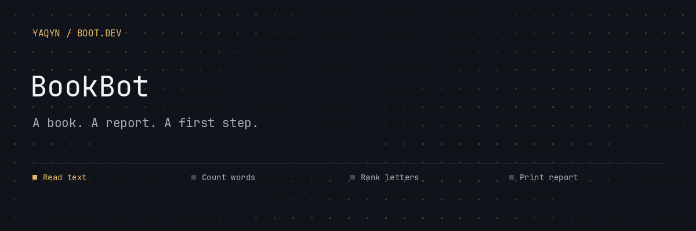

# BookBot

**Turn a plain-text book into a word and character report.**

BookBot reads a book, counts its words, and ranks alphabetic characters by frequency. A small command-line project that makes Python file handling, dictionaries, and sorting visible in one useful result.

##  Analyze a book

Requires **Python 3**. No third-party dependencies.

```bash
python3 main.py books/frankenstein.txt
```

Try the other bundled books:

```bash
python3 main.py books/mobydick.txt
python3 main.py books/prideandprejudice.txt
```


The report shows the total word count followed by letters in descending frequency. Character counting is case-insensitive; only alphabetic characters appear in the printed report. Words are separated by whitespace.

##  From text to statistics


| File | Responsibility |
| --- | --- |
| `main.py` | Read the supplied path and print the report |
| `stats.py` | Count words and characters; sort frequencies |
| `books/` | Three bundled books to explore |

##  What this project teaches

Reading files, working with dictionaries, sorting by a key, and accepting command-line arguments. Supply a readable plain-text file; omitting the path prints usage and exits with status 1.

---

Built by **[Abdulrahman M. Yaqyn](https://yaqyn.dev)** through the [Boot.dev](https://www.boot.dev) curriculum.
