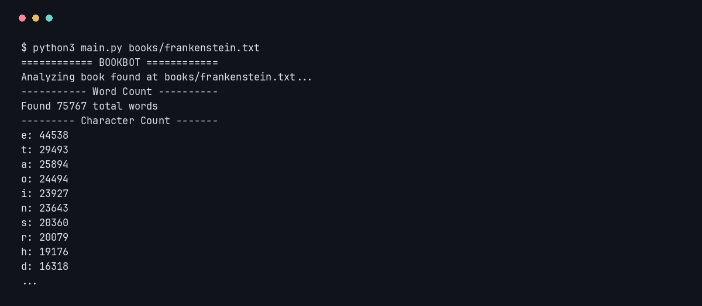
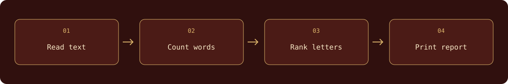

# TextScope — Text Analyzer

**Explore the words, letters, and vocabulary inside your books.**

TextScope reads text one line at a time, preserves the original word and letter counts, and adds vocabulary rankings, reading-time estimates, and multi-book comparisons. Export readable text, structured JSON, or a CSV summary without third-party dependencies.

##  Analyze a book

Requires **Python 3.10+**. No third-party dependencies or API keys.

```bash
./launch
```

Try the other bundled books:

```bash
./launch books/mobydick.txt
./launch books/prideandprejudice.txt
```



<sub>The original counts remain unchanged; current reports also include insights and top words.</sub>

Run `./launch` to analyze the bundled Frankenstein book, or pass one or more file paths. The launcher works from another directory when invoked by absolute path. The direct command remains `python3 main.py books/frankenstein.txt`.

```bash
./launch books/frankenstein.txt books/mobydick.txt --top 15 --min-word-length 5 --exclude their
./launch books/frankenstein.txt --format json --output reports/frankenstein.json
./launch books/*.txt --format csv --output reports/comparison.csv
```

| Option | What it controls |
| --- | --- |
| `--top N` | Number of ranked words; default 10 |
| `--min-word-length N` | Minimum length for word rankings; default 1 |
| `--exclude WORD` | Exclude a word from rankings; repeat for several words |
| `--reading-wpm N` | Reading-speed estimate; default 250 words per minute |
| `--encoding NAME` | Input encoding; default UTF-8 |
| `--format text/json/csv` | Readable report, full structured analysis, or summary rows |
| `--output PATH` | Save instead of printing; creates parent directories |

### Counting rules

- **Word count:** whitespace-separated tokens, preserving the course definition.
- **Letters:** lowercase character counts, alphabetic characters only, sorted by frequency and alphabetically on ties.
- **Vocabulary:** Unicode letter tokens, with optional internal apostrophes. Casefolding merges forms such as `Straße` and `STRASSE`; curly and straight apostrophes are equivalent. Numbers are excluded. This is a simple tokenizer, not a language-specific word segmenter.
- **Vocabulary percentage:** unique normalized vocabulary divided by all letter tokens. Filters affect rankings only.
- **Reading time:** whitespace word count divided by the selected words per minute, rounded up; empty books take zero minutes.
- **Characters and lines:** decoded code points and physical text lines, preserving line endings. No sentence/readability model is implied.

JSON always contains a list of book analyses, including letter counts and top words. CSV contains one summary row per book. Multiple-book text reports include a comparison table. The file is streamed by line; memory use grows with distinct vocabulary and the longest line rather than the full book.

Input failures return status 1 with a concise error; invalid CLI arguments return status 2. Use `--encoding` when a text file is not UTF-8. Every input must succeed before a report is written. Reports are replaced atomically, and the CLI rejects using an input book as the output path.

##  From text to statistics



| File | Responsibility |
| --- | --- |
| `main.py` | CLI, text/JSON/CSV reports, and atomic output |
| `stats.py` | Streaming analysis, vocabulary, and counting helpers |
| `books/` | Three bundled books to explore |
| `test_textscope.py` | Counting, Unicode, CLI, exports, and launcher checks |

##  What this project teaches

Reading files, working with counters and dictionaries, deterministic sorting, Unicode normalization, dataclasses, CLI design, and structured exports.

## Verify

```bash
python3 -m unittest -v
```

The tests need no external services. They compare all bundled books against the original counting functions, test the launcher from another directory, and exercise empty text, Unicode, filters, encoding errors, multiple-book exports, and atomic-write recovery. GitHub Actions runs the checks on Python 3.10 and 3.13.

---

Built by **[Abdulrahman M. Yaqyn](https://yaqyn.dev)** through the [Boot.dev](https://www.boot.dev) curriculum.
